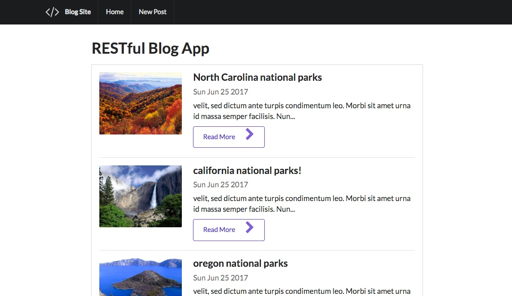

# Node RESTful api reference app

### mongoose
### semantic ui html framework
### npm method-override
allows forms to accept PUT and DELETE methods with the following sintax
```
<form method="POST" action="/blogs/<%= blog._id %>?_method=PUT">
</form>
```
```
Blog.put('/blogs/:id', function(req, res) {
```

### npm express-sanitizer 
ejs allows you to read user submited html and script data in the browser
```
  <%- blog.body %>
```
block users from injecting scripts in the page 
by ignoring script tags with express-sanitizer 



## todo
add error handling 
add tests
